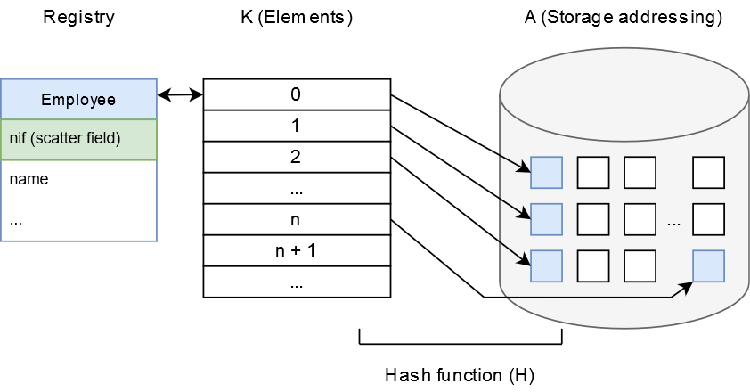

# 2.2 Hashing

### 2.2.1 ¿Qué es Hashing?

> In computing, a **Hash table \(or Hashing\)** is a data structure that implements an associative array abstract data type, a structure that can map keys to values. A **Hash table** uses a **Hash function** to compute an **index**, also called a **Hash code**, into an array of buckets or slots, from which the desired value can be found. During lookup, the key is hashed and the resulting hash indicates where the corresponding value is stored.

Tras leer la definición de la WikiPedia, podríamos definir que en informática, una **tabla Hash** \(o **Hashing**\) es una estructura de datos que asocia a través de una **función Hash \(H\)** un **campo clave \(campo de dispersión\)** con un **elemento \(K\)** y es almacenado en una **dirección de memoria \(A\)**, como por ejemplo un **Array**.


El termino **Hashing** también puede ser llamado: **Tabla hash, mapa hash, matriz asociativa, tabla de dispersión o tabla fragmentada**.


### 2.2.2 Entendiendo la técnica.

La técnica **Hashing** consiste en un **sistema de almacenamiento y búsqueda de elementos** a través de una **estructura de posiciones direccionables** dado un **campo clave** del elemento conocido como **campo de dispersión**.

El **campo de dispersión** se utiliza cómo **índice** para almacenar y recuperar el elemento completo.

La **función Hash \(H\)** se aplica al **campo de dispersión de un elemento \(K\)** para obtener la **dirección de almacenamiento \(A\)**.

* La función toma como entrada el valor del campo de dispersión del elemento.
* La función devuelve cómo salida el espacio de almacenamiento asignado.

#### Fórmula matemática:

$$
H: K → A
$$

Los problemas asociados a la técnica Hashing son:

* Disponer de un número elevado de **elementos \(K\)** y un conjunto pequeño de **direcciones de almacenamiento \(A\)**.
* Necesidad de una **función Hash \(H\)** que las relacione.



En la imagen, podemos ver que a un número "n" de **elementos \(K\)** se le aplica una **función Hash** a partir del **campo de dispersión NIF** y de esta forma obtener la **dirección de almacenamiento** en los **espacios de almacenamiento \(A\)**.

#### Caso práctico 1:

1. Disponemos del siguiente registro:

```text
class Client
{
    int id;
    string name;
    string nif;
}
```

2. El atributo NIF es elegido cómo campo de dispersión.

3. La capacidad de almacenamiento es A = \[0..99\]. Total 100 espacios de almacenamiento.

4. La representación de la función Hash sería: H: NIF → \[0..99\].

Por ejemplo, para realizar la función Hash podemos obtener los dos últimos números del NIF y utilizarlos cómo indice para su almacenamiento.

* 0 -&gt; H\(17951753\) = 53
* 1 -&gt; H\(18654123\) = 23
* 2 -&gt; H\(17621853\) = 53


Cómo podemos ver en el ejemplo, la técnica Hashing utilizada nos generaría un problema de colisión con los NIFs: 0 y 2.


### 2.2.3 Problemas de colisión

### Bibliografía

Referencia en inglés:

1. [https://en.wikipedia.org/wiki/Hash\_table](https://en.wikipedia.org/wiki/Hash_table)
2. [https://en.wikipedia.org/wiki/Hash\_function](https://en.wikipedia.org/wiki/Hash_function)

Referencia en español:

1. [https://es.wikipedia.org/wiki/Tabla\_hash](https://es.wikipedia.org/wiki/Tabla_hash)
2. [https://es.wikipedia.org/wiki/Funci%C3%B3n\_hash](https://es.wikipedia.org/wiki/Funci%C3%B3n_hash)

