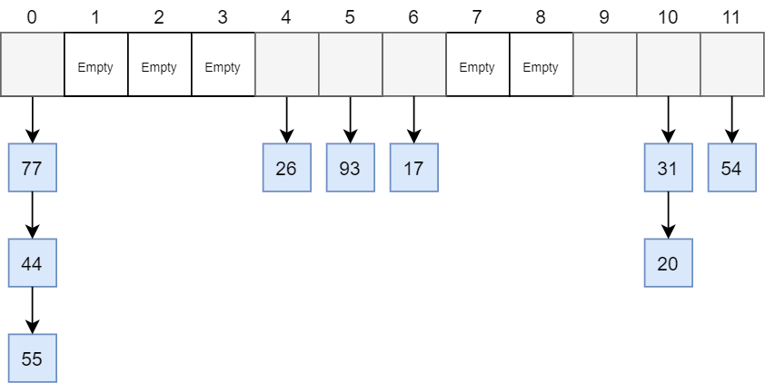
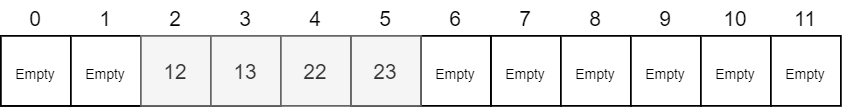
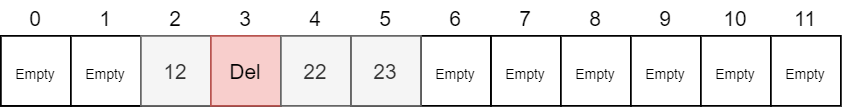

# 2.2 Hashing

### 2.2.1 ¿Qué es Hashing?

> In computing, a **Hash table \(or Hashing\)** is a data structure that implements an associative array abstract data type, a structure that can map keys to values. A **Hash table** uses a **Hash function** to compute an **index**, also called a **Hash code**, into an array of buckets or slots, from which the desired value can be found. During lookup, the key is hashed and the resulting hash indicates where the corresponding value is stored.

Tras leer la definición de WikiPedia, podríamos definir que en informática, una **tabla Hash** \(o **Hashing**\) es una estructura de datos que asocia a través de una **función Hash \(H\)** un **campo clave \(campo de dispersión\)** con un **elemento \(K\)** y es almacenado en una **dirección de memoria \(A\)**, como por ejemplo un **Array**.


El termino **Hashing** también puede ser llamado: **Tabla hash, mapa hash, matriz asociativa, tabla de dispersión o tabla fragmentada**.


### 2.2.2 Entendiendo la técnica Hashing

La técnica **Hashing** consiste en un **sistema de almacenamiento y búsqueda de elementos** a través de una **estructura de posiciones direccionables** dado un **campo clave** del elemento conocido como **campo de dispersión**.

El **campo de dispersión** se utiliza cómo **índice** para almacenar y recuperar el elemento completo.

La **función Hash \(H\)** se aplica al **campo de dispersión de un elemento \(K\)** para obtener la **dirección de almacenamiento \(A\)**.

* La función toma como entrada el valor del campo de dispersión del elemento.
* La función devuelve cómo salida el espacio de almacenamiento asignado.

**Fórmula matemática:**

$$
H: K → A
$$

Los problemas asociados a la técnica Hashing son:

* Disponer de un número elevado de **elementos \(K\)** y un conjunto pequeño de **direcciones de almacenamiento \(A\)**.
* Necesidad de una **función Hash \(H\)** que las relacione.


En la imagen, podemos ver que a un número "n" de **elementos \(K\)** se le aplica una **función Hash** a partir del **campo de dispersión \(NIF\)** y de esta forma obtener la **dirección de almacenamiento** en los **espacios de almacenamiento \(A\)**.

Las funciones Hash tienen varias aplicaciones:

* **Seguridad:** Se utiliza en criptografía, por ejemplo para la codificación de contraseñas, donde una contraseña **nunca** se debe guardar en **texto plano**. Normalmente a este tipo de encriptación se les denomina **Hashing Algorithm One Way**, es decir, solo tienen una dirección a partir de un texto inicial.
* **Transporte  de información.**
* **Estructura de datos.**
* **Correctores ortográficos.**
* **Tablas de compiladores \(basados en léxicos\).**
* **Diccionario de datos.**


**Determinística**: significa que dada una misma entrada, siempre va a generar el mismo valor como salida. Es decir, que no depende de una variable externa \(**transparencia referencial**\).


Existen diferentes estrategias para la definición de funciones Hash:

* Truncamiento.
* Doblamiento.
* Aritmética modular.
* Otras funciones:
  * Funciones criptográficas: [MD5](https://en.wikipedia.org/wiki/MD5), [SHA-1, SHA-256](https://en.wikipedia.org/wiki/Secure_Hash_Algorithms), etc.
  * [Jenkins Hash Function](https://en.wikipedia.org/wiki/Jenkins_hash_function).
  * [Cuckoo Hash Function](https://en.wikipedia.org/wiki/Cuckoo_hashing).
  * [Robin Hood Hash](https://en.wikipedia.org/wiki/Hash_table#Robin_Hood_hashing).
  * [Rayuela \(Hopscoth Hashing\)](https://en.wikipedia.org/wiki/Hopscotch_hashing)

#### 2.2.2.1 Truncamiento

Ignorar una parte de la clave y considerar únicamente el resto.

> H\(2**3**945**6**6**7**\) = 367

#### 2.2.2.2 Doblamiento

Dividir directamente la clave en varias partes y combinar estas \(sumas, restas, etc\). Si el resultado es mayor al número de posiciones, se trunca.

> H\(**23**_94_**56**_67_\) = 23 + 94 + 56 + 67 = 240

#### 2.2.2.3 Aritmética modular

Convertir la clave en un valor numérico entero \(si no lo es\) y calcular el resto \(módulo\).

> H\(23945667\) = 23945667 mod 1000 = 667

**2.2.2.4 Caso práctico**

1. Disponemos del siguiente registro:

```text
class Client
{
    int id;
    string name;
    string nif;
}
```

2. El atributo **NIF** es elegido cómo **campo de dispersión**.

3. La capacidad de almacenamiento es **A = \[0...99\]**. Total 100 espacios de almacenamiento.

4. Se decide elegir una **estrategia de Truncamiento** para la función Hash.

5. La representación de la función Hash sería: **H\(NIF\) → \[0...99\]**

Por ejemplo, al realizar la función Hash obtenemos los dos últimos números del NIF y se utilizan cómo indice para su almacenamiento.

* 0 → H\(17951753\) = 53
* 1 → H\(18654123\) = 23
* 2 → H\(17621853\) = 53


Cómo podemos ver en el ejemplo, la técnica Hashing utilizada nos generaría un problema de colisión con los elementos \(NIFs\): 0 y 2.


### 2.2.3 Problemas de colisión

Si dos campos de dispersión de dos elementos diferentes generan un Hash que como resultado es el mismo indice, se dice que existe una **colisión**. Los registros no podrán ser almacenados en la misma posición. En estos casos, cuando una casilla está ocupada, la función Hash debe buscar otra ubicación a almacenar y hacerlo de tal forma que podamos buscarlo cuando se requiera.

* Una función de cálculo H provoca colisión entre dos claves K1 y K2 si se cumple que **H\(K1\) = H\(K2\)**.
* Una tabla Hash tiene que tener un tamaño suficientemente grande para reducir el número de colisiones.
* Las colisiones suponen una penalización en la función Hash, porque se debe calcular en tiempo de ejecución y controlar las direcciones de almacenamiento libres implican mayor coste.
* Cuando una función Hash no genera ninguna colisión, se dice que es perfecta.


Un problema bastante común que ocurre con las funciones Hash es el **aglomeramiento**. El aglomeramiento ocurre cuando la estructura de la función Hash provoca que claves usadas comúnmente tiendan a caer muy cerca unas de otras o incluso consecutivamente en la tabla Hash. Esto puede degradar el rendimiento de manera significativa, cuando la tabla se llena usando ciertas estrategias de resolución de colisiones, como la exploración lineal.


#### 2.2.3.1 Soluciones al problema de colisión

Si la posición de un elemento ya esta ocupada, entonces hay que insertarlo en otra nueva mediante un proceso de **solución de colisiones**.


Es muy importante tener en cuenta donde ha sido almacenado el elemento con colisión para los procesos de búsqueda.


Existen varias técnicas de resolución de colisiones, pero las más populares son:

* Técnica Hashing Cerrado:
  * Exploración lineal
  * Exploración cuadrática
  * Pruebas dependientes de clave.
* Técnica Hashing Abierta:
  * Encadenamiento.

Todas las alternativas a una colisión se pueden expresar mediante una función. Ejemplo:

* En primer lugar, tenemos **H\[0\] = H\(K\)**, dirección candidata para la **clave K**.
* Si existe colisión, **se realiza un bucle en busca de una posición libre en la tabla Hash**, utilizando una **variable "i"** que se **inicia a 0** para iterar. Y se ejecuta la siguiente iteración, siendo **G\(x, y\)** una función de calculo de incremento:
  * **i = i + 1**
  * **H = G\(K, i\)**
* La función **G\(x, y\)** dependerá del tipo de técnica de resolución de colisiones escogida.

#### 2.2.3.1.1 Exploración lineal \(Técnica Hashing Cerrado\)

Se trata la tabla Hash como una **estructura circular**, el siguiente elemento después del último es el primero.

En el proceso de **inserción**, cuando ocurre una colisión se debe **recorrer la tabla Hash de forma secuencial y de forma circular a partir del punto de colisión, buscando el siguiente hueco libre**.

En el proceso de búsqueda, si se produce colisión se **recorre la tabla Hash secuencialmente y de forma circular. El proceso concluye cuando el elemento es hallado, o bien se encuentra una posición vacía**.

**Función G\(K, i\)**

| Sin colisión | Colisión |
| :--- | :--- |
| **H\[0\] = H\(K\) = K mod nElements** | **H = G\(K, i\) = \(H\(K\) + i\) mod nElements** |

**Ventajas**

* Se exploran todas las direcciones.
* Solo se produce un error si se ocupan todas las posiciones.

**Desventajas**

* Se producen agrupamientos alrededor de ciertas claves, mientras que otras zonas de almacenamiento permanecerían vacías.
* Si las concentraciones de claves son muy frecuentes, la función Hash se verá muy penalizada y la búsqueda será principalmente secuencial perdiendo así las ventajas de la técnica Hash **\(agrupamiento primario\)**.


El caso ideal es disponer de una tabla Hash cuyo tamaño sea el doble del número de elementos a insertar. El principal problema es que desperdicia mucha memoria.


#### 2.2.3.1.2 Exploración cuadrática \(Técnica Hashing Cerrado\)

Similar a la exploración lineal, dispone de una **estructura circular** con un **desplazamiento de posición \(inserción y búsqueda\) del cuadrado del valor de la iteración actual**.

**Función G\(K, i\)**

| Sin colisión | Colisión |
| :--- | :--- |
| **H\[0\] = H\(K\) = K mod nElements** | **H = G\(K, i\) = \(H\(K\) + i\(square\)\) mod nElements** |

**Ventajas**

* Evita el agrupamiento primario de la exploración lineal.

**Desventajas**

* No se evalúan todas las direcciones potencialmente libres.
* Puede generar falsos negativos, disponer de posiciones libres e indicar que no las hay.
* Mayor complejidad en la función Hash para calcular cuando a terminado el ciclo y conocer que se ha recorrido circularmente la tabla.
* Aparece el **agrupamiento secundario**, las claves que colisionen en la misma posición seguirán el mismo camino de saltos, haciendo cada vez mayor su dirección de almacenamiento.

#### 2.2.3.1.3 Dependiente de la clave \(Técnica Hashing Cerrado\)

La estructura es conjunto ordenado de **asociaciones** entre una **clave "i"** y un **valor de datos**.

$$
G(K,i) = G(i)
$$

El caso perfecto consiste en que las claves sean únicas para que exista una relación uno a uno y evitar las colisiones.

La solución reside en hacer que la exploración tras la colisión no dependa tan sólo de la posición inicial, sino también del propio valor de la clave.

* De esta forma, claves distintas que han sido enviadas a la misma posición inicial seguirán rutas distintas tras la colisión.
* Se consigue un mejor aprovechamiento de las posiciones vacías que existan en la tabla.

Para obtener otro parámetro dependiente de la clave se necesita definir una **segunda función de dispersión**. Lo habitual es que la segunda función defina el salto en la exploración.

**Función G\(K, i\)**

| Sin colisión | Colisión |
| :--- | :--- |
| **H\[0\] = H\(K\) = K mod nElements** | **H = G\(K, i\) = \(H\(K\) + d · i\) mod nElements** |

Cada nuevo intento explora el hueco situado a una distancia **d** a la derecha. Si **d = 1** tendríamos una exploración lineal.

El valor del salto **"d"** depende del valor de la clave.

* Un método habitual de definirlo, si se utiliza como función de dispersión secundaria el método de división: **d = max\(1, K / nElements\)**

Una exploración a base de saltos de **"d"** celdas no siempre recorrerá todas las celdas. Por ejemplo, si la tabla tiene tamaño 12 y el salto es 4, sólo vamos a recorrer las 3 celdas distintas antes de entrar en un ciclo.


**Teorema:** Si **nElements** y **d** son primos entre sí se garantiza un recorrido completo.

**Propuesta 1:** Imponer que nElements sea un número primo y d no sea múltiplo de nElements. Si hay que reestructurar la tabla para hacerla más grande, escoger el siguiente primo mayor que 2 x nElements.

**Propuesta 2:** Imponer que nElements sea una potencia de dos, y que "d" sea un número impar \(si es par, se le suma 1\).


**Ventajas**

* Velocidad y sencillez.

**Desventajas**

* Si **H\(K1\) = H\(K2\) = H\[0\]**, siempre se producirá colisión para esas dos claves.

#### **2.2.3.1.4 Encadenamiento** \(Técnica Hashing Abierta\)

Los registros que colisionan se van añadiendo a una lista asociada a la posición que colisiona.

Cada posición de la tabla se mantiene con una lista enlazada en la que se van insertando elementos cuyo valor Hash les asigna la misma posición.



### 2.2.4 Eliminación

Una posición vacía indica el final de una ruta de exploración. Si al borrar un elemento marcamos la casilla como vacía, entonces se rompen las rutas en las que éste elemento es un punto intermedio.

Si la exploración no se detiene en las casillas vacías, las búsquedas fallidas recorrerían toda la tabla.

El recolocar los elementos de las rutas rotas causaría nuevas recolocaciones en cascada de los elementos existentes.

La solución para estos casos es **no eliminar el elemento, pero marcar la casilla como borrada** para que en la búsqueda no se encuentre.

**2.2.4.1 Caso práctico**

Hemos aprendido que una posición vacía indica el final de una ruta de exploración. Imaginemos que se quiere eliminar el valor 13 de la siguiente tabla:



Si al borrar el elemento, se marca la casilla como vacía, entonces se rompen las rutas en las que este elemento es un punto intermedio. Dejaría de ser accesible los elementos 22 y 23.

Cómo solución, no eliminamos el elemento sino que marcamos la casilla cómo borrada para que la siguiente búsqueda no la encuentre.



### 2.2.5 Eficiencia

El **factor de carga** de una tabla Hash se calcula como:

$$
α = N/M
$$

Donde **N** es el **número de celdas ocupada** y **M** es el **tamaño de la tabla Hash**.

**La probabilidad de que un nuevo registro colisione en el primer intento es igual al factor de carga** \(suponiendo que todos los espacios de almacenamiento tienen la misma probabilidad de ser accedidos\). **Contra mayor sea el factor de carga mas colisiones habrá**. El factor de carga comprende de 0 a 1.

La probabilidad de colisión en el segundo intento es:

$$
N(N-1) - (M(M-1))
$$

La probabilidad de colisión en el intento "i" es:

$$
N(N-i ... N-(i+1)) - (M(M-i ... M(M-(i+1)))
$$

Para números N y M grandes, la probabilidad de colisión en el intento "i" se toma aproximadamente cómo:

$$
(N/M)(square)
$$

El **número de intentos antes de insertar** un registro se calcula:

$$
1 / (1 - α)
$$

El **número de intentos antes de encontrar un registro** se calcula:

$$
numAttempts = (1 / α) * ln(1 / 1 - α)
$$

### 2.2.5 Rehashing \(Redispersión\)

Cuando la tabla Hash se llena \(o supera el umbral de inserción eficiente en las pruebas lineales, cuadraticas, etc\) se degrada el rendimiento y es necesario una **redispersión**.

La **redispersión** consiste en obtener una nueva tabla Hash con mayor capacidad de almacenamiento cuyo tamaño depende de la alternativa de colisión elegida. Ejemplo: Siguiente número primo, siguiente potencia de dos, etc.

Es decir, aumentar el tamaño de la tabla para reducir el factor de carga.


Se deben pasar los valores de la antigua tabla Hash a la nueva. Por cada elemento en la vieja tabla, se calcula su nueva posición en la nueva y se inserta en ella. Si no se recolocan los valores ya insertados, se producirán errores a la hora de la búsqueda.


Normalmente, la redispersión se aplica cuando:

* La ocupación de la tabla es superior al 50%.
* Cuando se supera cierto número de colisiones.
* Cada vez que hay una colisión.

La redispersión, aunque necesaria, supone un alto coste:

* Mayor uso de memoria dinámica.
* Coste en tiempo de ejecución, debido a la recolocación de los elementos y del calculo del siguiente tamaño.


También se puede realizar **redispersión inversa**. Acortar o reducir el tamaño de la tabla Hash cuando su ocupación es &lt; 30 %.


### 2.2.6 Conclusiones

¿Qué tipo de técnica Hashing es mejor? ¿Hashing cerrado \(lineal, cuadrática, etc\) o Hashing abierto \(lista enlazada\)?

* Ambas tienen un tiempo de inserción y búsqueda O\(n\) para el peor caso.
* Ambas tienen un tiempo de inserción y búsqueda O\(α\) para el caso medio, cuando \(α &lt; 1\)
* La técnica de Hashing cerrado usa menos espacio, pero necesita redispersión. Esta recomendado para datos almacenados en disco.
* La técnica de Hashing abierta usa más espacio, pero no necesita de redispersión \(utiliza memoria dinámica\). Esta recomendado para datos almacenados en memoria.

### Bibliografía

Referencias en inglés:

1. [https://en.wikipedia.org/wiki/Hash\_table](https://en.wikipedia.org/wiki/Hash_table)
2. [https://en.wikipedia.org/wiki/Hash\_function](https://en.wikipedia.org/wiki/Hash_function)

Referencias en español:

1. Temario UCAM Murcia. Backtraking y Hashing.
2. [https://es.wikipedia.org/wiki/Tabla\_hash](https://es.wikipedia.org/wiki/Tabla_hash)
3. [https://es.wikipedia.org/wiki/Funci%C3%B3n\_hash](https://es.wikipedia.org/wiki/Funci%C3%B3n_hash)

