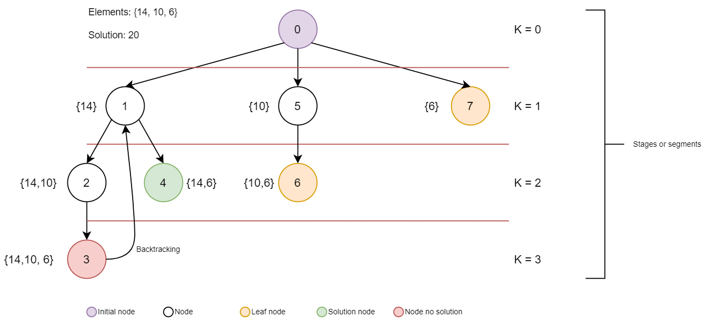
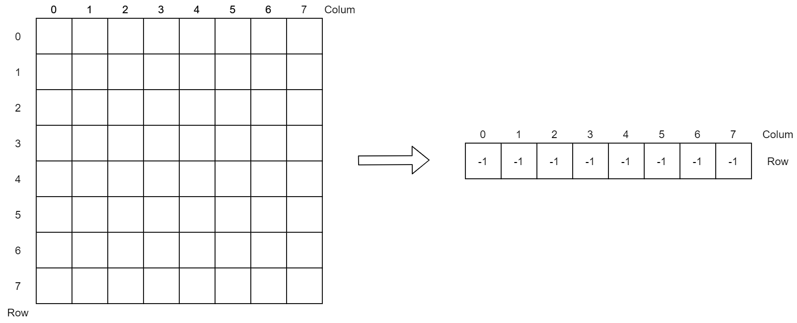
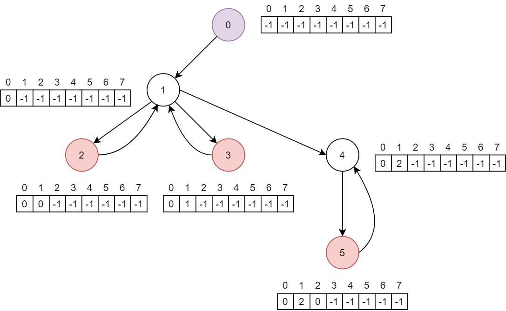

# 2.4 Backtracking

### 2.4.1 ¿Qué es Backtracking?

> Backtracking is a general algorithm for finding all \(or some\) solutions to some computational problems, notably constraint satisfaction problems, that incrementally builds candidates to the solutions, and abandons a candidate \("backtracks"\) as soon as it determines that the candidate cannot possibly be completed to a valid solution.

**Backtracking** \(o **vuelta atrás**\) es una **técnica algorítmica para encontrar soluciones a problemas que tienen una solución completa**, en los que el orden de los elementos no importa, y en los que existen una serie de variables a cada una de las cuales debemos asignarle un valor teniendo en cuenta unas restricciones dadas.

O lo que es lo mismo, es una **estrategia algorítmica que busca todas las posibles soluciones dado un conjunto de variables inicial** para encontrar el resultado definido por el problema.

La técnica de **Backtracking** se apoya en el uso de la [recursividad](2.3-recursividad.md) para la búsqueda exhaustiva de todas las combinaciones posibles.

El termino fue utilizado por primera vez por el matemático [D.H. Lehmer](https://es.wikipedia.org/wiki/Derrick_Henry_Lehmer) en la década de 1950.

### 2.4.2 Explicando la técnica Backtracking con un caso práctico

Dado un conjunto de números enteros {14, 10, 6} encontrar si existe algún subconjunto cuya suma sea igual a 20.



### 2.4.3 Entendiendo la técnica Backtracking

**Backtracking** es una técnica algorítmica para hacer una búsqueda exhaustiva y sistemática por todas las configuraciones posibles del espacio de búsqueda del problema.

Se suele aplicar en la resolución de un gran número de problemas, muy especialmente en los de **decisión** y **optimización**.

* **Problemas de decisión**: Búsqueda de las soluciones que satisfacen ciertas restricciones.
  * Ejemplo: [Problema de las N-Reinas](2.4-backtracking.md#2-4-5-caso-practico-el-problema-de-las-8-reinas).
* **Problemas de optimización**: Búsqueda de la mejor solución en base a una función objetivo.
  * Ejemplo: [Problema de la mochila](2.4-backtracking.md#2-4-7-extra).


**Los algoritmos de tipo Backtracking suelen ser muy ineficientes**. Aunque se utilizan para resolver problemas para los que no existe un algoritmo eficiente.

Para mejorar la técnica de Backtracking se recomienda el uso de la programación paralela.


De forma general, el método del Backtracking, concebido como tal, genera todas las secuencias de forma sistemática y organizada, de manera que prueba todas las posibles combinaciones de un problema hasta que encuentra la correcta. En general, la forma de actuar consiste en elegir una alternativa del conjunto de opciones en cada etapa del proceso de resolución, y si esta elección no funciona \(no nos lleva a ninguna solución\), la búsqueda vuelve al punto donde se realizó esa elección, e intenta con otro valor. Cuando se han agotado todos los posibles valores en ese punto, la búsqueda vuelve a la anterior fase en la que se hizo otra elección entre valores. Si no hay más puntos de elección, la búsqueda finaliza.

La técnica de Backtracking es usada en muchos ámbitos de la programación, por ejemplo, para el cálculo de expresiones regulares o para tareas de reconocimiento de texto y de sintaxis de lenguajes regulares. También es usado incluso en la implementación de algunos lenguajes de programación y da soporte a muchos algoritmos en inteligencia artificial.

De forma matemática:

* El conjunto de soluciones se expresa en tuplas, donde cada una es el valor de la solución.

$$
s = (v_1, v_2, ... v_n)
$$

* El conjunto parcial de soluciones será aquel en que se encuentre en cierto nivel K:

$$
s_p = (v_1, v_2, ... v_k) → K <= n
$$

* Si se puede añadir un elemento más, la solución avanza a otro nivel \(K+1\).
* Si no existe ningún valor, se retrocede al valor \(K-1\).
* Se continua hasta que una solución parcial sea una solución al problema o hasta que no queden mas posibilidades a probar.

El resultado es equivalente a hacer **una búsqueda en profundidad** en el árbol de soluciones. Sin embargo, este árbol es implícito, no se almacena en ningún lugar.

Los hijos de un nodo del nivel K son las prolongaciones posibles al añadir una nueva etapa.

Para examinar el conjunto de posibles soluciones es suficiente con recorrer el árbol construyendo soluciones parciales a medida que se avanza en el recorrido.

**Los números de cada nodo marcan el recorrido del árbol.**

Los **nodos hoja** representan que puede no haber una solución por ese camino y hay que volver atrás, o bien que es una solución.

### 2.4.4 Eficiencia

La **eficiencia** consiste en la medida del coste en el uso de recursos que necesita el algoritmo para llevar a cabo su tarea.

Los recursos más importantes son:

* Tiempo de ejecución
* Espacio de almacenamiento

En conclusión, podemos decir que debido al coste creado en tiempo y memoria \(por la pila recursiva\) los algoritmos de vuelta atrás no son todo lo eficientes que deberían, y debemos dejarlos para resolver parte de otros problemas o problemas reducidos. Aún así, la gran ventaja que tienen es que si hay solución la encontrarán.

**Ventajas:**

* Si existe una solución, la calcula.
* Es un esquema sencillo de implementar.
* Adaptable a las características especificas de cada problema.

**Desventajas:**

* Coste exponencial en la mayoría de los casos.
* Si el espacio de búsqueda es infinito, la solución, aunque exista, no se encontrará nunca.
* Por termino medio consume mucha memoria al tener que almacenar las llamadas recursivas.

**La aplicación del Backtracking antes de programar consiste en:**

* Qué tipo de árbol es adecuado para el problema
  * ¿Cómo es la representación de la solución \(tupla\)?
* Cómo generar un recorrido según el árbol
  * Generar un nuevo nivel.
  * Generar los niveles hermanos.
  * Retroceder en el árbol.
* Determinar cómo es la forma del árbol de Backtracking, o lo que es lo mismo, cómo es la representación de la solución.
* Elegir el esquema de algoritmo adecuado, adaptándolo en caso necesario.
* Implementar las funciones genéricas para la aplicación concreta: según la forma del árbol y las características del problema.
* Posibles mejoras usando variables locales con valores acumulados, realizar podas del árbol, etc.

La medida se denomina **complejidad** del algoritmo y pueden ser agrupadas por soluciones:

* **Dependencia con el tamaño de la entrada:** No se tarda igual buscar en un ventor de 10 elementos que buscar en uno de 1000000.
* **Dependencia de valores de la entrada:** Aunque fijemos el tamaño del vector, no se tarda lo mismo en buscar un valor que está en la primera posición que otro que no esté en el vector.
* **Dependencia del procesador:** Aunque fijemos el tamaño y los valores concretos del vector y el valor buscado, el algoritmo tardará tiempos distintos en ordenadores diferentes.

#### 2.4.4.1 Dependencia con el tamaño de la entrada

* Uno o más valores relacionados con los datos de entrada que sirven de parámetros para expresar las funciones que miden el uso de recursos del algoritmo.
* En el caso de algoritmos que trabajan sobre colecciones de datos, suele ser el número de datos que contienen.
* Para algoritmos de cálculo con enteros de tamaño arbitrario, se suele usar el número de bits de esos enteros. Se tratan cómo un array de bits.
* Expresar la complejidad no mediante un valor sino por una función cuyo parámetro\(s\) es el tamaño de la entrada.
* El tamaño de la entrada, si es un único valor, se suele denominar n.
* La complejidad temporal se denominará mediante la función T\(n\).
* La complejidad espacial se denominará mediante la función E\(n\).
* De esa función nos interesa, más que su forma concreta, su ritmo de crecimiento.

#### 2.4.4.2 Dependencia de valores de la entrada.

* Dividir el análisis en casos.
* Analizar subconjuntos de las entradas cuya complejidad es la misma para todas las entradas de ese subconjunto \(análisis de peor y mejor caso\).
* Calcular un promedio, dado una distribución estadística de las entradas. Tipicamente se supone que todas las posibles entradas son equiparables \(Análisis de caso promedio y tiempo amortizado\).

**Cota superior \(Análisis del peor caso\)**

* Calcula la complejidad del algoritmo para las entradas \(del mismo tamaño\) que maximizan la complejidad.

$$
Tworst (n) = max[T(n, input)]
$$

**Cota inferior \(Análisis en el mejor caso\)**

* Calcula la complejidad del algoritmo para las entradas \(del mismo tamaño\) que minimizan la complejidad.

$$
Tbest (n) = min[T(n, input)]
$$

#### 2.4.4.3 Dependencia del procesador

* No medir tiempo en segundos, sino en número de operaciones elementales ejecutadas.

**Operación elemental:** Toda operación que tarda un tiempo constante en cualquier procesador razonable.

Tipicamente se consideran elementales las asignaciones, operaciones aritméticas y relacionales con tipos de datos de tamaño fijo, acceso a arrays.

En general se cuenta solo con un tipo de operación concreta, la más relevante para la eficiencia del algoritmo.

Es una medida independiente del procesador.

### 2.4.5 Caso práctico: El problema de las 8-Reinas

El problema de las **n-Reinas \(N-Queens\)** es un juego cuyo objetivo consiste en colocar **n-reinas en una tablero de ajedrez \(n\*n\) sin que se amenacen entre ellas según las normas del ajedrez** \(que no estén en la misma fila, columna o diagonal\).

**Restricciones explicitas:**

$$
s_i = [1, 2, 3, 4, 5, 6, 7, 8] → 1 <= i <= 8
$$

$$
|s_i|^8 = 8^8 = 16.777.216
$$

**Restricciones implícitas:**

Podemos deducir que cada reina se ha de colocar en una columna, partiendo del caso inicial que la reina "i" se colocara en la fila "i".

* Las restricciones para este problema consiste en que dos reinas no pueden colocarse en la misma fila.

$$
(y_i, y_j) → y_i <> y_j
$$

* Todas las reinas deben estar en columnas diferentes:

$$
(x_i, x_j) → x_i <> x_j
$$

* Todas las reinas deben estar en diagonales diferentes:

$$
(x_i, x_j) → |j-i| <> |x_j-x_i|
$$

Gracias a la primera restricción implícita podemos decir que todas las soluciones son permutaciones de {1, 2, 3, 4, 5, 6, 7, 8}, lo que reduce el espacio de soluciones a 8! = 40320.

**1º Paso: Representación de la solución**

Utilizaremos un vector de n elementos, donde el valor del indice sera la columna y el valor la posición de la fila. El valor -1 significará celda no ocupada.



**2º Paso: Representación del árbol**



**3º Paso: Codificación**

Ejemplo en pseudocódigo:

```c
const n = 8;

function validation(solution=array[n] of int, k: int): boolean
{
    for i=0 to k-1 DO
        // absoluteValue = |x-y|
        if (solution[i] === solution[k] or absoluteValue(solution[i], solution[k]) === absoluteValue(i, k)) then
            return false;
        end
    end
    
    return true;
}

function nQueens(solution=array[n] of int, stage: int): boolean
{
    if stage > n then return false;
    
    success = false;
    solution[stage] = 0;
    
    repeat
        solution[stage] = solution[stage] + 1;
        
        if validation(solution, stage) then
            if stage <> n THEN
                success = queens(solution, stage + 1);
            else
                success = true;
            end
        end
    until (solution[stage] === n) OR success === true;
    
    return success;
}
```

Ejemplo en JavaScript:

[http://jsfiddle.net/rocketegg0/wu6cpp5v/](http://jsfiddle.net/rocketegg0/wu6cpp5v/)

### 2.4.6 Otros casos prácticos

Otros problemas que se pueden resolver con Backtracking:

1. [Problema de la mochila](https://es.wikipedia.org/wiki/Problema_de_la_mochila).
2. Problema del laberinto.
3. [Problema del salto de caballo](https://es.wikipedia.org/wiki/Problema_del_caballo).
4. [Problema de los cuadrados mágicos](https://es.wikipedia.org/wiki/Cuadrado_m%C3%A1gico).
5. Sudoku

### 2.4.7 Extra







### 2.4.8 Bibliografía

Referencias en español:

1. Curso Técnico Superior Universitario: Programación avanzada. [Ilerna Online](https://www.ilerna.es/es/fp-universidad/programacion-avanzada-tecnico-superior-universitario-484).
2. Grado en Ingeniería Informática. Temario: Backtraking y Hashing. [UCAM Murcia](https://online.ucam.edu/estudios/grados/informatica-a-distancia).
3. [https://es.wikipedia.org/wiki/Vuelta\_atr%C3%A1s](https://es.wikipedia.org/wiki/Vuelta_atr%C3%A1s)
4. [El esquema algorítmico del Backtracking](https://openlibra.com/es/book/el-esquema-algoritmico-del-backtraking)

Referencias en inglés:

1. [https://en.wikipedia.org/wiki/Backtracking](https://en.wikipedia.org/wiki/Backtracking)

